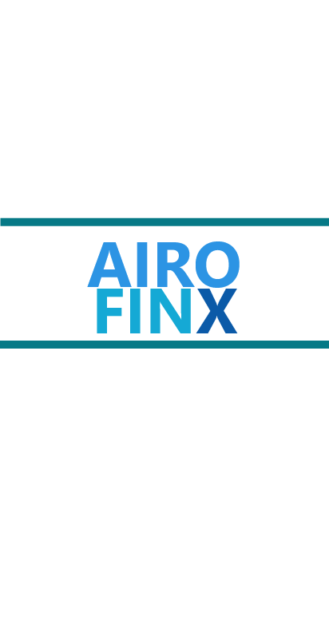
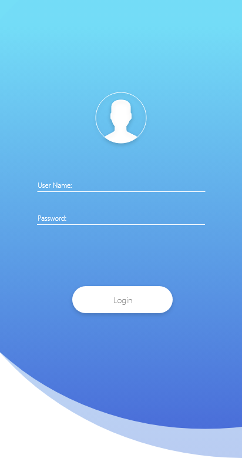
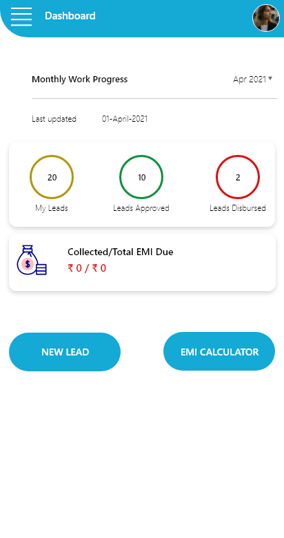
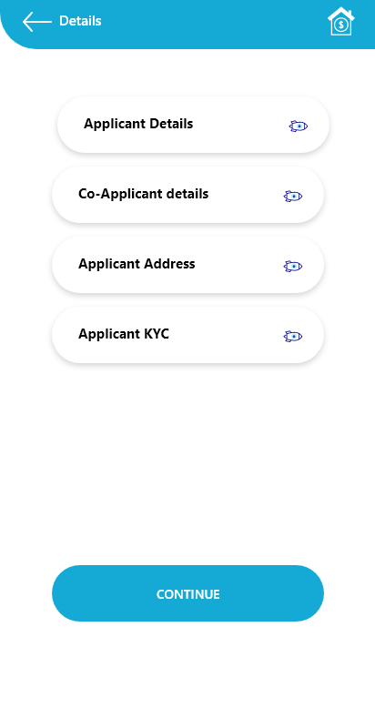

# airo-finx

open source finance framework, ionic based application for LOS (Loan Origination System) for NBFC  

## What App Do

This application allows bank personnel  to apply for loans with information of Applicant, Co-Applicant and Guarantor. After bank personnel applies for a loan, the loan shows under the dashboard for the corresponding lender and lender can approve the loan. After loan approval, the bank personnel sees loan status "Accepted". While waiting for approval, the loan status shows "Waiting".

## [Download PDF Design of Screen](./screenshot/Finance-App.pdf)

## ScreenShot

<table border="1">
  <tr>
    <th>Splash Screen</th>
    <th>Login Screen</th>
    <th>Dashboard Screen</th>
  </tr>
  <tr>
    <td></td>
    <td></td>
    <td></td>
  </tr>

  <tr>
    <th>My Lead Screen</th>
    <th>Lead Deatil Screen</th>
    <th>New Lead Screen</th>
  </tr>
  <tr>
    <td></td>
    <td></td>
    <td></td>
  </tr>

  <tr>
    <th>Applicant Details Screen</th>
    <th>T&C Screen</th>
    <th>Verification Screen</th>
  </tr>
  <tr>
    <td></td>
    <td></td>
    <td></td>
  </tr>

<tr>
    <th>Loan ID Generation Screen</th>
  </tr>
  <tr>
    <td></td>
  </tr>

 </table>

